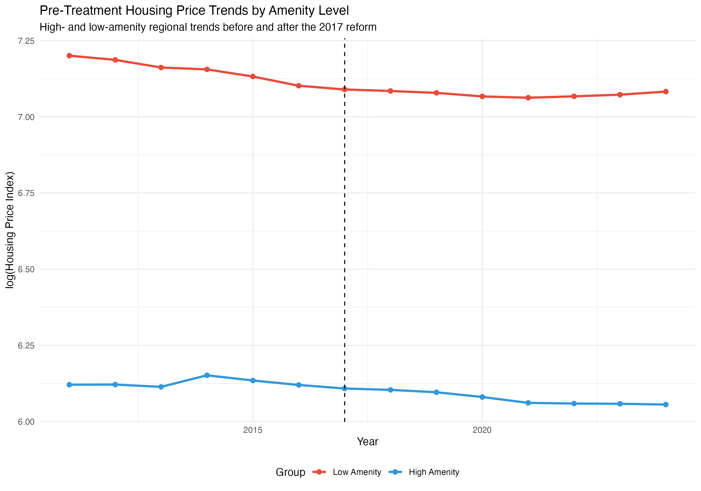
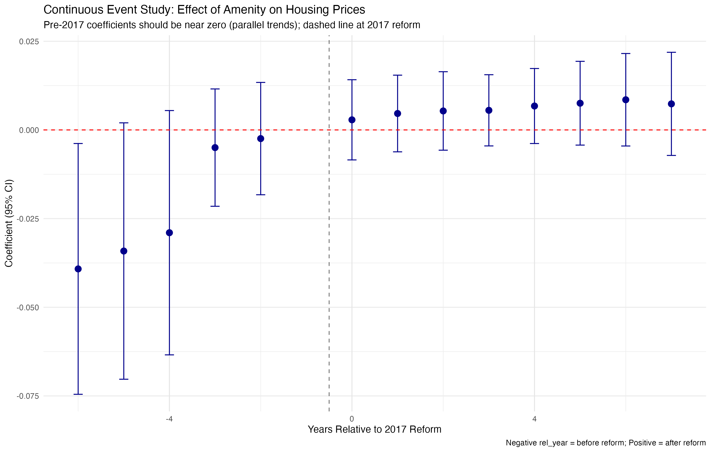
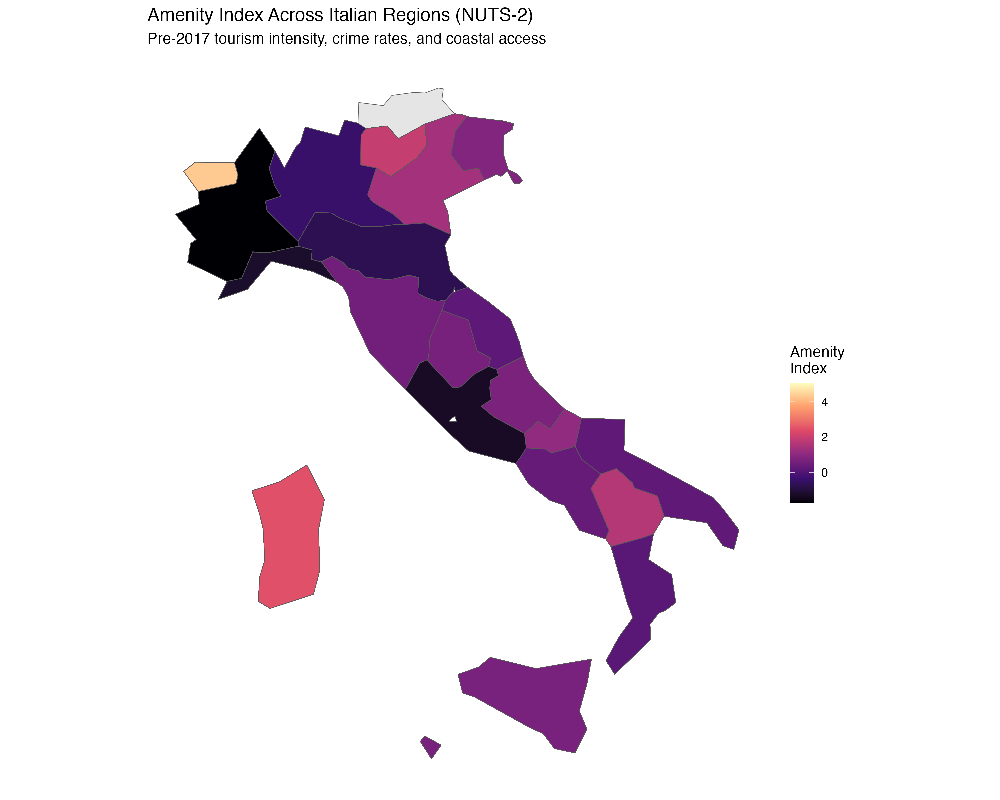
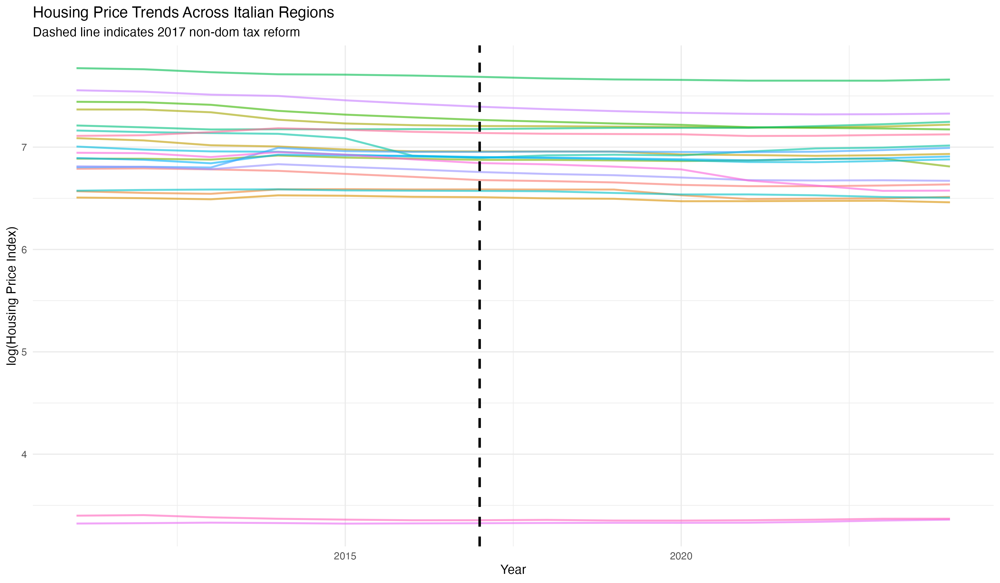

# continuous-did-italy-tax
Continuous DiD Analysis of Italy's 2017 Non-Dom Tax Reform

This repository contains a cleaned version of code used in a project studying the regional housing effects of Italy's 2017 non-dom tax regime.

## Research question
Did high-amenity Italian regions experience larger post-2017 increases in housing prices and housing-cost burdens?

## Method
- Continuous treatment difference-in-differences
- Region and year fixed effects
- Treatment intensity proxied by a regional amenity index
- Event-study specification for pre-trend and dynamic analysis

## Repository structure
- `code/`: includes .qmd files of the R code and html outputs
- `output/`: saves the tables and figures
- `data/`: includes merged and cleaned ISTAT datasets.

## Note
This repository contains a simplified and reorganised version of the original group project code. The public version reflects my own restructuring of the workflow for clarity and reproducibility.

## Key Results

### Pre-treatment trends
Parallel trends across high- and low-amenity regions prior to the 2017 reform.

### Event study
Dynamic effects of the reform by amenity level. Pre-treatment coefficients are close to zero.

### Amenity index
Regional variation in treatment intensity.

### Housing price trends
Raw regional dynamics around the reform.

